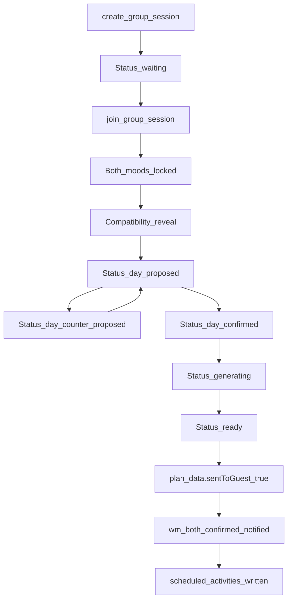

# Moody Flow Design

## Scope and Guardrails

This document is the canonical reference for redesigning the **Mood Match (Moody) section only** of WanderMood.

Non-negotiable scope:
- Redesign only Mood Match surfaces and contracts.
- Preserve all currently working non-Mood-Match app flows.
- Do not redesign the full app shell, onboarding system, auth architecture, or unrelated tabs.
- Use the existing WanderMood design system only (no new colors, no new font families).

In-scope surfaces:
- Flutter: Mood Match Hub, Create, Join, Lobby, Reveal, Day Picker, Match Loading, Result.
- Flutter bridge surfaces: Time Picker and Confirmation (defined as migration/merge strategy).
- Notification and deep-link behavior that enters or resumes Mood Match.
- Landing join page for Mood Match invite links.

Out-of-scope surfaces:
- Global app information architecture.
- Unrelated home/explore/profile/social systems unless they are direct Mood Match entry/exit points.

---

## Product Intent

Mood Match should feel like:
- premium and intentional,
- emotionally intelligent and socially confident,
- state-transparent (users always know what is happening),
- resilient (recovery-first in reconnect, cold start, stale push, and race conditions).

Design objective:
- make every Mood Match screen reflect backend truth,
- remove ambiguity in handoff states,
- keep interaction delight without sacrificing reliability.

---

## Premium UX Principles (Moody Section)

1. **State over decoration**
   - UI must always mirror session status and proposal ownership.
2. **One clear decision at a time**
   - each screen has one dominant action and one fallback action.
3. **High-trust feedback**
   - explicit confirmations for sent proposals, accepted counters, and saved-to-My-Day.
4. **Recovery by design**
   - every critical decision is recoverable from persisted data, not only realtime.
5. **Social confidence**
   - copy tone is warm and concise, never vague.
6. **Premium readability**
   - strong hierarchy, generous spacing, restrained motion, and calm transitions.

---

## Canonical Backend State Machine



### Status Contract

- `waiting`: session exists, participants can join, moods may still be missing.
- `day_proposed`: owner proposed date/slot; guest decision required.
- `day_counter_proposed`: guest proposed alternate date/slot; owner decision required.
- `day_confirmed`: day/slot handshake complete; generation can proceed.
- `generating`: AI plan generation in progress.
- `ready`: plan exists and can be reviewed/swapped/confirmed.
- `expired` / `error`: terminal interruption states with explicit exit UX.

---

## Backend-to-UI Event Contract (Canonical)

For Mood Match, all UI consumers must normalize realtime notifications to:
- recipient filter: `recipient_id == currentUserId`
- event type: `event_type`
- payload root: `payload`
- event data root: `payload.data`

Normalized event envelope:

```json
{
  "id": "uuid",
  "eventType": "planUpdate | groupTravelUpdate | ...",
  "recipientId": "uuid",
  "senderId": "uuid | null",
  "createdAt": "iso",
  "title": "string | null",
  "message": "string | null",
  "data": {
    "event": "day_proposed | day_counter_proposed | day_accepted | plan_ready | swap_requested | ...",
    "session_id": "uuid",
    "...": "..."
  }
}
```

Fallback extraction for backward compatibility:
- if `payload.data` missing, try `payload`.
- if legacy rows exist, read `event_data`/`data` adapter path.
- adapter emits one stable shape to all screens.

---

## End-to-End Screen Matrix (Flutter)

Each screen below defines purpose, entry contract, backend dependency, primary UX, and recovery behavior.

### 1) Mood Match Hub

Purpose:
- launch, resume, or cancel current session context.

Entry:
- direct route (`/group-planning`) or deep-link/push-driven resume.

Backend dependencies:
- active sessions for current user,
- existing plan presence,
- pending invite state.

Primary UX:
- resume card if active session exists,
- clear primary CTAs: Create / Join,
- one-tap continue to correct stateful next screen.

Recovery:
- if stale local prefs conflict with backend, backend wins.
- if session expired, clear resume affordance with explicit message.

---

### 2) Create Session

Purpose:
- owner starts new Mood Match session.

Entry:
- from Hub create CTA.

Backend:
- `create_group_session` RPC,
- duplicate waiting-session reuse rule.

Primary UX:
- minimal setup (title optional),
- immediate transition to lobby/share.

Recovery:
- if waiting session already exists, route back to that session.

---

### 3) Join Session

Purpose:
- guest joins by code or QR/deep link.

Entry:
- app route `/group-planning/join?code=...` or manual join flow.

Backend:
- `join_group_session` RPC.

Primary UX:
- frictionless code acceptance,
- clear errors: invalid, expired, full.

Recovery:
- failed join remains on screen with editable code and precise guidance.

---

### 4) Lobby (Mood Lock)

Purpose:
- both members lock current mood.

Entry:
- from create/join or resumed waiting session.

Backend:
- `group_session_members.mood_tag` + `submitted_at`,
- peer notifications via realtime notification RPC.

Primary UX:
- lock-in action with social visibility (self/peer state),
- waiting state copy while partner is pending.

Recovery:
- if both locked and reveal not completed, route to reveal.
- if reveal completed and status progressed, jump to day picker/match loading per status.

---

### 5) Reveal

Purpose:
- emotional bridge: compatibility result + momentum into scheduling.

Entry:
- from lobby after both moods locked.

Backend:
- compatibility metadata and participants.

Primary UX:
- premium reveal moment (short, meaningful, non-blocking),
- clear continue CTA.

Recovery:
- reveal completion persisted; never loops unnecessarily.

---

### 6) Day Picker (Handshake Core)

Purpose:
- owner proposes date/slot; guest accepts or counters; owner resolves.

Entry:
- from reveal or resumed by status/events.

Backend:
- writes `planned_date`,
- status transitions `day_proposed` / `day_counter_proposed` / `day_confirmed`,
- counter fields `proposed_slot`, `proposed_by_user_id`,
- proposal object in `plan_data.dayProposal`.

Primary UX:
- owner mode: propose and wait.
- guest mode: accept or counter.
- owner counter modal: accept or re-counter.

Recovery:
- if realtime missed, recover from persisted session/plan state.
- always treat persisted state as source of truth.

### 6A) Date Change Negotiation UX Playbook (Critical)

Goal:
- support real-life scheduling mismatch without friction (example: proposed Monday -> counter to a later date).

Verified backend support:
- session fields: `planned_date`, `proposed_slot`, `proposed_by_user_id`.
- statuses: `day_proposed`, `day_counter_proposed`, `day_confirmed`.
- repository actions: `writePlannedDate`, `writeProposedSlot`, `upsertPendingDayProposal`, `clearProposedSlot`.
- events: `day_proposed`, `day_counter_proposed`, `day_accepted`, `day_guest_declined_original`.

Owner UX states:
1. **Propose Date/Slot**
   - CTA: `Send Proposal`
   - output: `day_proposed`
2. **Waiting for Guest**
   - non-blocking waiting card with proposal summary.
3. **Counter Received**
   - blocking decision sheet:
     - `Accept New Date`
     - `Suggest Another Date`
4. **Accepted**
   - output: `day_confirmed` + `day_accepted` event.

Guest UX states:
1. **Proposal Received**
   - decision sheet:
     - `Works for me`
     - `Pick another date`
2. **Counter Compose**
   - same day/slot selector quality as owner (not a reduced form).
3. **Counter Sent**
   - output: `day_counter_proposed`.
4. **Waiting for Owner**
   - explicit status indicator with sent date and slot.

Premium interaction requirements:
- selected date chip and slot chip must remain visible in all waiting/decision states.
- every send/accept/counter action gets immediate toast + state card transition.
- no silent fallback to default slot; preserve explicit `whole_day` when selected.

---

### 7) Match Loading (Generation)

Purpose:
- plan generation with confidence and clear fallback.

Entry:
- after `day_confirmed` or acceptance event.

Backend:
- `tryGeneratePlanIfComplete`,
- session status `generating` -> `ready`,
- idempotent fetch of generated plan.

Primary UX:
- elegant loading state with deterministic progress language,
- resilient polling until plan appears or terminal error state.

Recovery:
- on generation timeout/error, retry affordance with clear explanation.

---

### 8) Result (Shared Plan Review)

Purpose:
- collaborative review, send-to-guest gate, swaps, confirmations, and final save.

Entry:
- from match loading, plan-ready event, or push.

Backend:
- `group_plans.plan_data`:
  - `sentToGuest`,
  - `ownerConfirmed`, `guestConfirmed`,
  - `swapRequests`, `swapProposals`,
  - `wm_both_confirmed_notified`.

Primary UX:
- owner confirms slots then sends plan.
- guest confirms or proposes swaps.
- both sides receive slot/swap outcomes clearly.

Recovery:
- resume exact decision state from persisted `plan_data`.
- dedupe realtime-triggered sheets and toasts.

### 8A) Activity Change Negotiation UX Playbook (Swap Flow)

Goal:
- allow either user to reject a specific activity and propose a better alternative while preserving shared alignment.

Verified backend support:
- plan keys: `swapRequests`, `swapProposals`, `ownerConfirmed`, `guestConfirmed`, `guestReviewState`.
- repository actions: `setSwapRequest`, `ownerResolveSwap`, `guestResolveSwap`, `clearSwapRequest`.
- events: `swap_requested`, `swap_accepted`, `swap_declined`.
- slot lock behavior: on new swap request, both confirmations for that slot are reset until resolved.

UX contract by role:

Requester (owner or guest):
1. Tap `Swap this activity` on a slot.
2. Open curated alternatives sheet (slot-compatible options).
3. Confirm proposal -> slot enters `Pending Approval`.
4. Requester sees immutable pending state until peer resolves.

Responder:
1. Receives contextual sheet with:
   - current activity,
   - proposed replacement,
   - slot impact.
2. Binary choice:
   - `Accept Swap`
   - `Keep Current`
3. On accept:
   - activity replaced in slot,
   - confirmations for slot restored to true for both.
4. On decline:
   - original activity retained,
   - pending request cleared.

Premium interaction requirements:
- side-by-side comparison card: current vs proposed.
- outcome animation and copy must clearly state accepted/declined and by whom.
- pending swap chip always visible on the affected slot card.
- prevent duplicate proposals on same slot while pending.

---

### 9) Bridge Surfaces: Time Picker + Confirmation

Current role:
- legacy finalization path for personal start-time flow.

Decision strategy:
- keep as compatibility route only during migration.
- do not make this the canonical post-`both_confirmed` destination unless date context is guaranteed.

Target:
- canonical completion lives in Result flow with deterministic Save-to-My-Day action.

---

## Navigation Contracts (Normal, Cold Start, Push)

### Normal path
Hub -> Create/Join -> Lobby -> Reveal -> Day Picker -> Match Loading -> Result -> Save to My Day

### Cold start resume
- resolve session + plan first,
- route by backend status and plan existence, not stale local-only flags.

### Push-open path
- route by normalized `data.event`,
- if payload is partial, route to safest owner screen (Day Picker or Result) and hydrate from backend before showing decision UI.

---

## Notification and Deep-Link Routing Spec

### Event-to-screen ownership
- `mood_match_invite`, `guest_joined`, `mood_locked` -> Lobby
- `day_proposed`, `day_counter_proposed`, `day_accepted`, `day_guest_declined_original` -> Day Picker
- `plan_ready`, `swap_requested`, `swap_accepted`, `swap_declined` -> Result
- `both_confirmed` -> Result as canonical finalization surface

Rationale:
- Day Picker owns day handshake decisions.
- Result owns plan/swaps/confirmation and final save.
- Avoid routing `both_confirmed` into screens requiring missing date context.

### Deep-link invite contract
- URL: `/group-planning/join?code=<CODE>`
- app deep-link target: `wandermood://group-planning/join?code=<CODE>`
- code normalization: trim + uppercase.
- invalid code fallback: informative message + install/open affordance.

---

## Realtime Alignment Remediation Plan

Problem:
- some listeners still assume `user_id` and direct `event_data`/`data`.

Target:
- unify all Mood Match consumers on recipient-aware payload adapter.

Required alignment actions:
1. Introduce one Mood Match event adapter used by Lobby, Day Picker, Result.
2. Filter by recipient contract and parse `payload.data` first.
3. Maintain temporary backward-compatible extraction for legacy rows.
4. Add dedupe safeguards for repeated stream emissions.
5. Add test scenarios for missed insert + persisted-state recovery.

Acceptance:
- no critical action depends solely on realtime arrival.
- every actionable event can be recovered from persisted backend state.

---

## Premium Visual System (Mood Match Only)

Hard design-system constraint:
- Do not introduce any new color tokens.
- Do not introduce any new font families.
- Reuse current app typography scale and component language.
- Extend from existing Mood Match/WanderMood UI primitives instead of creating parallel styles.

## Tokens and Theme

Base palette:
- Forest primary, Cream surface, Charcoal text, Stone secondary.

Mood Match deep layer:
- rich deep-warm surfaces for immersive moments (lobby/reveal/result headers and modal scrims).

Component quality bar:
- rounded geometry with confident radii,
- soft depth, low-noise shadows,
- restrained gradients for hierarchy, not decoration.

### Typography
- Strong headline clarity for state and action.
- Compact but readable supporting copy.
- Numeric/date/chip text optimized for scan speed.

### Spacing and Rhythm
- 8-point baseline.
- generous vertical breathing around major decision blocks.
- grouped controls with clear visual ownership.

### Motion
- quick, premium easing for transitions (no bouncy overuse).
- interrupt-safe animations in network/realtime screens.
- reduced-motion fallback respected.

### Component Guidance
- CTA hierarchy:
  - primary: filled, single dominant action.
  - secondary: tonal/outlined supporting action.
- chips/selectors:
  - explicit selected vs pending visual states.
- modals/sheets:
  - clear title + consequence statement + binary actions.
- loading:
  - contextual progress copy, not generic spinner-only states.

---

## Copy and Tone (Moody Match)

Tone:
- confident, warm, concise.
- avoids generic filler.
- always clarifies “what happened” and “what next.”

Critical moments needing exact clarity:
- proposal sent,
- proposal accepted/declined/countered,
- generation started/finished/failed,
- plan sent to guest,
- both confirmed,
- saved to My Day succeeded/failed.

---

## Accessibility Requirements

- minimum touch target: 44x44.
- contrast: WCAG AA minimum for all text and controls.
- semantic announcements for status changes and confirmations.
- focus order and keyboard compatibility where applicable.
- reduced motion support for reveal/loading animations.

---

## Cross-Surface Spec (Landing + App)

Landing join page must:
- validate code length and normalize display.
- attempt deep-link open immediately.
- provide explicit fallback:
  - open in app link,
  - install links,
  - visible join code for manual entry.
- match app tone and premium trust cues (not generic/plain fallback copy).

---

## QA and Acceptance Matrix

## A→Z Scenario Checklist

1. Owner creates session; friend joins successfully.
2. Both lock moods; reveal shown once.
3. Owner proposes day; guest accepts.
4. Owner proposes day; guest counters; owner accepts.
5. Multi-counter loop resolves cleanly.
6. Generation completes and routes to result.
7. Owner confirms slots and sends to guest.
8. Guest confirms all slots.
9. Swap proposed and accepted.
10. Swap proposed and declined.
11. Both confirmed event arrives while app backgrounded.
12. Cold start with active `day_proposed`.
13. Cold start with active `day_counter_proposed`.
14. Cold start with `ready` + existing plan.
15. Stale/duplicate realtime emissions.
16. Stale push payload with missing optional keys.
17. Expired session handling from hub/join/lobby.
18. Save to My Day success and failure paths.

### Pass Criteria
- UI route always matches backend state.
- no dead-end screens.
- no action silently fails without user feedback.
- all critical decisions recover after restart.

---

## Telemetry Recommendations

Track at minimum:
- status transition latency (`day_confirmed -> generating -> ready`),
- proposal loop count before confirm,
- realtime delivery vs persisted recovery rate,
- drop-off per screen,
- finalization success rate (`saveMoodMatchPlanToMyDayForAllMembers`),
- swap request acceptance/decline rates.

---

## Implementation Roadmap (Post-Approval)

Phase 1: Contract Alignment (no visual overhaul yet)
- unify realtime adapter and payload parsing.
- align push event routing ownership.
- stabilize resume/recovery logic.

Phase 2: Navigation Ownership Cleanup
- ensure each status has one canonical screen owner.
- demote bridge paths that create ambiguity.

Phase 3: Premium UI Redesign
- apply component, spacing, motion, and copy specs to Mood Match screens.

Phase 4: Hardening
- QA matrix execution,
- accessibility polish,
- telemetry verification and tuning.

No-regression rule:
- maintain existing backend business logic and table contracts.
- redesign presentation and flow ownership without breaking current working non-Moody app areas.

---

## Approval Gate

This document is the reference baseline.

Next step after approval:
- execute implementation in phases above, strictly scoped to Mood Match/Moody section.
